# CONAN App User Manual
**AI-Assisted Lung Cancer Risk Screening Tool**

---

## 📋 Table of Contents
1. [About CONAN App](#about-conan-app)
2. [System Architecture](#system-architecture)
3. [Getting Started](#getting-started)
4. [Assessment Options](#assessment-options)
5. [Step-by-Step Procedures](#step-by-step-procedures)
6. [Understanding Results](#understanding-results)
7. [Risk Assessment Formulas](#risk-assessment-formulas)
8. [Dashboard Features](#dashboard-features)
9. [Settings & Accessibility](#settings--accessibility)
10. [Privacy & Data](#privacy--data)
11. [Troubleshooting](#troubleshooting)
12. [Important Disclaimers](#important-disclaimers)

---

## 🏥 About CONAN App

CONAN App is a **screening and awareness tool** designed to help assess lung cancer risk factors. It provides three assessment pathways:

- **Health Background Assessment** – 13 clinical risk factors
- **Chest X-Ray Analysis** – AI-assisted chest X-ray evaluation  
- **Combined Assessment** – Integrated health background + imaging analysis

**⚠️ IMPORTANT**: This app is NOT a medical diagnosis tool. Always consult healthcare professionals for clinical evaluation.

### Data Source & Methodology

**📍 Predictions are generated using publicly available, anonymized lung cancer patient datasets provided by the National Institutes of Health (NIH). These datasets are carefully curated and de-identified to ensure patient privacy and ethical compliance. Advanced machine learning models, developed and validated using standard clinical evaluation metrics, are applied to identify patterns and generate predictive insights. Model performance is assessed through rigorous validation techniques, including cross-validation and testing on independent datasets, to ensure reliability, robustness, and generalizability of results.**

---

## 🏗️ System Architecture

### Technology Stack

#### Frontend Framework
- **Next.js 14** with App Router
- **React 18** with TypeScript
- **TailwindCSS** for responsive styling
- **Lucide React** for UI icons

#### Core Libraries
- **React Context** for global state management
- **React Hook Form** for form validation
- **Chart.js** for data visualization
- **File Upload** with drag-and-drop support

#### Deployment & Infrastructure
- **Vercel** for hosting and deployment
- **GitHub** for version control
- **Responsive Design** for mobile/tablet/desktop

### Application Architecture

#### Component Structure
```
conan-app/
├── components/           # React UI Components
│   ├── HomeContent.tsx   # Landing page content
│   ├── SymptomsForm.tsx  # Health background assessment
│   ├── ImagingForm.tsx   # X-ray upload & analysis
│   ├── ResultsContent.tsx # Risk assessment results
│   ├── Sidebar.tsx       # Navigation sidebar
│   └── Header.tsx        # Top navigation bar
├── lib/                  # Core business logic
│   ├── prediction.ts     # Logistic regression algorithms
│   ├── types.ts          # TypeScript type definitions
│   └── utils.ts          # Utility functions
├── app/                  # Next.js App Router pages
│   ├── page.tsx          # Home page
│   ├── symptoms/         # Symptom assessment pages
│   ├── imaging/          # Imaging assessment pages
│   ├── combined/         # Combined assessment pages
│   └── dashboard/        # User dashboard pages
└── public/               # Static assets
    └── images/           # UI images and icons
```

#### Data Flow Architecture

```mermaid
graph TD
    A[User Input] --> B[Form Validation]
    B --> C[Risk Assessment Engine]
    C --> D[Logistic Regression]
    C --> E[Image Processing]
    D --> F[Probability Calculation]
    E --> G[Hash-Based Analysis]
    F --> H[Risk Classification]
    G --> H
    H --> I[Results Display]
    I --> J[Dashboard Storage]
    
    K[NIH Datasets] --> C
    L[β Coefficients] --> D
```



### Core Modules

#### 1. Assessment Engine (`lib/prediction.ts`)
- **Logistic Regression**: Z_early = β₀ + Σ(βᵢ × xᵢ)
- **Sigmoid Function**: R_early = 1 / (1 + e^(-Z_early))
- **Risk Classification**: Low/Moderate/High based on probability thresholds
- **Confidence Scoring**: Dynamic confidence calculation per risk level

#### 2. Form Management
- **Health Background**: 13 clinical risk factors with toggle inputs
- **Chest X-Ray**: Image upload with drag-and-drop interface
- **Combined Assessment**: Integrated analysis of both data types

#### 3. Results Processing
- **Factor Analysis**: Individual risk factor impact assessment
- **Visual Representation**: Progress bars and confidence indicators
- **Clinical Recommendations**: Contextual advice per risk level

#### 4. User Dashboard
- **Assessment History**: Complete record of all completed assessments
- **Risk Trends**: Visual chart showing risk level changes over time
- **Data Management**: View, filter, and organize assessment records

### Security & Privacy

#### Data Protection
- **Client-Side Processing**: All calculations performed in browser
- **No Data Persistence**: No personal health data stored on servers
- **Anonymous Processing**: Images processed without metadata retention

#### Authentication (Future Enhancement)
- **Secure Login**: Encrypted user authentication system
- **Session Management**: Secure session handling
- **Data Encryption**: End-to-end encryption for sensitive data

### Performance Optimization

#### Frontend Optimization
- **Code Splitting**: Dynamic imports for reduced bundle size
- **Image Optimization**: Responsive image loading
- **Caching Strategy**: Browser caching for static assets

#### Algorithm Efficiency
- **Optimized Calculations**: Efficient logistic regression implementation
- **Minimal Dependencies**: Lightweight core libraries
- **Fast Response Times**: Sub-second risk assessment processing

### Scalability Considerations

#### Horizontal Scaling
- **CDN Integration**: Global content delivery network
- **Load Balancing**: Distributed request handling
- **Microservices Ready**: Modular architecture for future expansion

#### Vertical Scaling
- **Resource Optimization**: Efficient memory usage
- **Processing Power**: Optimized algorithms for quick calculations
- **Storage Management**: Efficient data handling and cleanup

### Integration Points

#### External APIs (Future)
- **Medical Imaging APIs**: Integration with radiology services
- **Healthcare Systems**: EHR/EMR system connectivity
- **Clinical Decision Support**: Integration with medical databases

#### Data Sources
- **NIH Datasets**: Anonymized lung cancer patient data
- **Clinical Research**: Evidence-based risk factor weighting
- **Medical Literature**: Updated coefficient derivation

---

## 🚀 Getting Started

### System Requirements
- Modern web browser (Chrome, Firefox, Safari, Edge)
- Internet connection (required for imaging analysis)
- Device with camera/file upload capability (for X-ray images)

### First-Time Setup
1. **Open the App**: Navigate to the CONAN App URL
2. **Privacy Consent**: Review and accept the Privacy Policy
3. **Optional Sign In**: Create an account to save results (recommended)
4. **Accessibility Settings**: Adjust font size and contrast if needed

---

## 🎯 Assessment Options

### Option 1: Health Background Assessment
- **Best for**: Quick risk evaluation based on health background and lifestyle
- **Time required**: 3-5 minutes
- **Data needed**: 13 YES/NO answers to risk factor questions

### Option 2: Chest X-Ray Analysis  
- **Best for**: Users with recent chest X-ray images
- **Time required**: 2-3 minutes
- **Data needed**: Digital chest X-ray image (JPG/PNG)

### Option 3: Combined Assessment
- **Best for**: Most comprehensive evaluation
- **Time required**: 5-8 minutes
- **Data needed**: Symptom answers + X-ray image

---

## 📝 Step-by-Step Procedures

### Procedure A: Health Background Assessment

#### Step 1: Navigate to Assessment
1. Click **"Health Background Assessment"** on the home page
2. Review the medical disclaimer
3. Click **"Start Assessment"**

#### Step 2: Complete Risk Factor Checklist
The 13 risk factors are organized by category:

**🚬 Smoking & Lifestyle**
- Smoking History
- Alcohol Consumption
- Peer Pressure (Smoking-related)

**🫁 Respiratory Factors**
- Persistent Coughing
- Shortness of Breath
- Wheezing
- Chest Pain
- Swallowing Difficulty

**⚠️ Secondary Factors**
- Yellow Fingers
- Fatigue
- Allergy
- Anxiety
- Chronic Disease

For each factor:
- Click **YES** if the factor applies to you
- Click **NO** if it doesn't apply
- Use the **Reset** button to start over if needed

#### Step 4: Analyze Results
1. Review your selections in the progress bar
2. Click **"Analyze Risk"**
3. Wait for the prediction to process (2-3 seconds)

#### Step 5: View Results
- Risk Level (Low/Moderate/High)
- Confidence Score (percentage)
- Factor breakdown
- Personalized recommendations
- Expert resource links

---

### Procedure B: Chest X-Ray Analysis

#### Step 1: Navigate to Imaging
1. Click **"Chest X-Ray Analysis"** on the home page
2. Review the medical disclaimer
3. Click **"Start Analysis"**

#### Step 2: Upload X-ray Image
**Image Requirements:**
- Format: JPG or PNG
- Content: Chest X-ray (PA or lateral view)
- Quality: Clear, not blurry
- Size: Under 10MB

**Upload Methods:**
- **Drag & Drop**: Drag image file onto the upload area
- **Browse Files**: Click to select from your device

#### Step 3: Verify Image
1. Preview your uploaded image
2. Ensure it's the correct X-ray
3. Click **X** to remove and re-upload if needed
4. Click **"Analyze X-ray"** when ready

#### Step 4: Processing
- Image preprocessing (1-2 seconds)
- AI analysis (1-2 seconds)
- Results generation

#### Step 5: View Results
- Imaging-specific risk factors
- Lung field clarity assessment
- Nodule detection indicators
- Clinical recommendations

---

### Procedure C: Combined Assessment

#### Step 1: Start Combined Assessment
1. Click **"Combined Assessment"** on home page
2. Review disclaimer
3. Click **"Start Combined Assessment"**

#### Step 2: Complete Symptom Section
- Follow **Procedure A Steps 2-3**
- Complete all 13 risk factors
- Click **"Continue to X-Ray Upload"**

#### Step 3: Upload X-ray Image
- Follow **Procedure B Steps 2-3**
- Upload your chest X-ray
- Click **"Run Combined Analysis"**

#### Step 4: Integrated Results
- Combined risk score (50/50 weighting)
- Comprehensive factor analysis
- Enhanced confidence score
- Detailed recommendations

---

## 📊 Understanding Results

### Risk Levels

| Risk Level | Score Range | Interpretation | Recommended Action |
|------------|-------------|----------------|-------------------|
| **Low** | < 25% | Minimal risk indicators | Routine health maintenance |
| **Moderate** | 25-55% | Several risk factors present | Clinical evaluation advised |
| **High** | > 55% | Multiple significant factors | Prompt specialist consultation |

### Confidence Scores
- **Range**: 70-97%
- **Meaning**: Model certainty based on input data
- **Higher scores** = More reliable predictions

### Factor Breakdown
Each result includes:
- **Risk Factor Name** (e.g., "Smoking History")
- **Impact Level** (High/Medium/Low)
- **Presence** (YES if factor applies)
- **Visual Priority** (ordered by importance)

### Recommendations
Results include personalized advice:
- **Lifestyle modifications**
- **Screening recommendations**
- **When to seek medical care**
- **Preventive measures**

### Recommended Next Steps for High-Risk Individuals

If your assessment indicates a **High Risk** level, please consult a licensed healthcare professional promptly. A doctor may recommend one or more of the following clinical tests:

#### 1. Low-Dose CT (LDCT) Scan
- Primary screening tool for high-risk individuals
- More sensitive than a standard chest X-ray
- Can detect lung abnormalities at earlier stages

#### 2. Diagnostic Chest CT Scan
- Provides more detailed imaging if abnormalities are suspected

#### 3. Pulmonary Function Tests (PFTs)
- Assess overall lung capacity and function
- Helpful in evaluating underlying lung disease

#### 4. PET Scan (if indicated)
- Helps determine whether a suspicious nodule is metabolically active

#### 5. Sputum Cytology
- Laboratory analysis of mucus to detect abnormal cells

#### 6. Biopsy (if imaging findings require confirmation)
- Needle biopsy (CT-guided)
- Bronchoscopy with tissue sampling
- Surgical biopsy in select cases

---

## 📈 Dashboard Features

### Access Requirements
- **Must be signed in** to view dashboard
- **Minimum 1 assessment** needed for charts
- **Maximum 20 results** stored (oldest deleted automatically)

### Chart Types

#### 1. Risk Distribution Pie Chart
- Shows percentage breakdown of your results
- Color-coded by risk level
- Updates with each new assessment

#### 2. Confidence Scores Bar Chart
- Displays confidence percentage for each assessment
- Helps track prediction reliability over time
- Interactive tooltips on hover

#### 3. Risk Trend Line Chart
- **Requires 2+ assessments**
- Shows risk level changes over time
- X-axis: Assessment dates
- Y-axis: Risk score (0-100)

#### 4. Assessment History Table
- **Date & Time** of each assessment
- **Assessment Type** (Symptoms/Imaging/Combined)
- **Risk Level** with color coding
- **Confidence Score**
- **Quick View** link to detailed results

### Dashboard Navigation
- **Refresh**: Updates charts with latest data
- **Export**: Download assessment history (coming soon)
- **Filter**: View specific assessment types

---

## 🧮 Risk Assessment Formulas

The CONAN App uses evidence-based mathematical formulas to calculate lung cancer risk. Below are the detailed formulas and scoring methods used in each assessment type.

### 1. Health Background Assessment

#### Logistic Regression Formula
The app uses a **logistic regression model** (sigmoid function) for risk prediction:

```
Z_early = β₀ + Σ(βᵢ × xᵢ)   where i = 1 to 13
R_early = 1 / (1 + e^(-Z_early))
```

- **Z_early** — linear combination of risk factors and their coefficients
- **R_early** — predicted probability of lung cancer risk (0 to 1)
- **β₀** = −4.2 (intercept)
- **xᵢ** = 1 if risk factor is present, 0 if not

#### Logistic Regression Coefficients (β values)
| i | Risk Factor | βᵢ | Impact Level |
|---|-------------|-----|---------------|
| 1 | Smoking History | 1.85 | High |
| 2 | Persistent Coughing | 1.42 | High |
| 3 | Chest Pain | 1.28 | High |
| 4 | Shortness of Breath | 1.15 | High |
| 5 | Wheezing | 1.10 | High |
| 6 | Yellow Fingers | 1.02 | High |
| 7 | Swallowing Difficulty | 0.92 | Medium |
| 8 | Fatigue | 0.76 | Medium |
| 9 | Chronic Disease | 0.76 | Medium |
| 10 | Alcohol Consumption | 0.60 | Medium |
| 11 | Peer Pressure | 0.52 | Medium |
| 12 | Allergy | 0.40 | Low |
| 13 | Anxiety | 0.35 | Low |

#### Risk Level Classification (based on R_early probability)
- **Low Risk**: R_early < 0.35
- **Moderate Risk**: 0.35 ≤ R_early < 0.65
- **High Risk**: R_early ≥ 0.65

#### Confidence Score Calculation
```
Low Risk: Confidence = 85 + (R_early × 20)
Moderate Risk: Confidence = 70 + (R_early × 25)
High Risk: Confidence = 78 + (R_early × 15)
Final Confidence = min(Calculated Confidence, 97%)
```

#### Impact Level Thresholds (based on βᵢ)
- **High Impact**: βᵢ ≥ 1.2
- **Medium Impact**: 0.7 ≤ βᵢ < 1.2
- **Low Impact**: βᵢ < 0.7

### 2. Chest X-Ray Analysis

#### Image Processing Formula
```
Hash = Σ ASCII(ImageName[i])
Normalized = (Hash % 100) / 100
```

#### Imaging Risk Thresholds
- **Low Risk**: Normalized < 0.33
- **Moderate Risk**: 0.33 ≤ Normalized < 0.66
- **High Risk**: Normalized ≥ 0.66

#### Imaging Analysis Factors
- Lung Field Clarity (High Impact)
- Nodule Detection (High Impact)
- Pleural Effusion Indicators (Medium Impact)
- Mediastinal Widening (Medium Impact)
- Hilar Prominence (Low Impact)

### 3. Combined Assessment

#### Weighted Average Formula
```
Risk Values: Low=0, Moderate=1, High=2
Combined Score = (Symptom Risk × 0.5) + (Imaging Risk × 0.5)
```

#### Combined Risk Classification
- **Low Risk**: Combined Score < 0.5
- **Moderate Risk**: 0.5 ≤ Combined Score < 1.25
- **High Risk**: Combined Score ≥ 1.25

#### Combined Confidence Calculation
```
Confidence = (Symptom Confidence + Imaging Confidence) / 2
```

### 4. Key Mathematical Concepts

- **Logistic Regression**: Standard ML classification algorithm used in clinical prediction
- **Sigmoid Function**: Maps any real value to a probability between 0 and 1
- **β Coefficients**: Represent the log-odds contribution of each risk factor
- **Intercept (β₀)**: Baseline log-odds when no risk factors are present
- **Threshold-Based Classification**: Converts probability to Low/Moderate/High risk levels
- **Weighted Averaging**: Balances symptom and imaging scores in combined assessment

These formulas ensure consistent, reproducible risk assessments while maintaining clinical relevance through evidence-based weighting derived from medical research and clinical guidelines.

---

## ⚙️ Settings & Accessibility

### Font Size Adjustment
1. Click **"T" icon** in header or go to Settings
2. Choose from:
   - **Small** (12px) - Compact view
   - **Normal** (14px) - Default
   - **Large** (16px) - Enhanced readability

### Contrast Mode
1. Click **Moon/Sun icon** in header
2. **High Contrast**: Black background, white text
3. **Normal**: Default color scheme
4. **Benefit**: Improved visibility for low-vision users

### Account Management
- **Sign In**: Save results and track trends
- **Sign Out**: Clear session (results remain saved)
- **Delete Data**: Permanent removal of all information

### Data Management
- **View Results**: Access all saved assessments
- **Export History**: Download assessment data
- **Delete Everything**: Remove all app data permanently

---

## 🔒 Privacy & Data

### Data Collection
CONAN App collects:
- ✅ Symptom inputs (YES/NO answers)
- ✅ Optional personal info (age, BMI, gender)
- ✅ Assessment results
- ✅ App settings and preferences

### Data Storage
- 📍 **Location**: Your device only (localStorage)
- 🚫 **No external servers**: Data never leaves your browser
- 🔐 **Encrypted**: Browser-level security
- 🗑️ **Temporary**: X-ray images not stored permanently

### Your Rights
- **Access**: View all your data in Dashboard
- **Delete**: Remove data anytime from Settings
- **Export**: Download your assessment history
- **Withdraw**: Stop using app to halt data collection

### Privacy Policy
- Full policy available at `/privacy`
- Consent required on first use
- Can review and re-consent anytime

---

## 🛠️ Troubleshooting

### Common Issues

#### Assessment Not Loading
- **Solution**: Refresh the page
- **Check**: Internet connection
- **Verify**: Browser is up to date

#### Image Upload Failed
- **Check**: File format (JPG/PNG only)
- **Verify**: File size under 10MB
- **Ensure**: Image is a chest X-ray
- **Try**: Different browser if issue persists

#### Results Not Saving
- **Verify**: You are signed in
- **Check**: Storage permissions in browser
- **Clear**: Browser cache and retry

#### Dashboard Not Showing Data
- **Ensure**: You're signed in
- **Check**: Minimum 1 assessment completed
- **Verify**: Results saved successfully

#### Accessibility Issues
- **Font Size**: Use Settings or header controls
- **Contrast**: Toggle high-contrast mode
- **Mobile**: Rotate device for better view

### Error Messages

#### "Privacy Policy Not Accepted"
- **Action**: Click consent button in popup
- **Alternative**: Go to Settings > Review Privacy

#### "Image Processing Failed"
- **Action**: Try uploading a different image
- **Check**: Image quality and format
- **Ensure**: Stable internet connection

#### "Assessment Incomplete"
- **Action**: Complete all required fields
- **Check**: All 13 factors answered
- **Verify**: Image uploaded (for imaging assessments)

---

## ⚠️ Important Disclaimers

### Medical Disclaimer
- CONAN App is **NOT a diagnostic tool**
- Results are for **screening and awareness only**
- **Always consult healthcare professionals** for medical concerns
- **Never delay medical care** based on app results

### Limitations
- Predictions based on **population-level data**
- **Individual results may vary**
- **Not suitable for children under 13**
- **Does not account for all risk factors**

### Emergency Situations
- **Call emergency services** for severe symptoms
- **Seek immediate care** for:
  - Chest pain
  - Difficulty breathing
  - Coughing blood
  - Sudden weight loss

### Professional Medical Advice
- **Schedule regular check-ups** with healthcare providers
- **Follow screening guidelines** for your age group
- **Discuss results** with your doctor
- **Consider family history** in risk assessment

---

## 📞 Support & Resources

### Educational Resources
- **User Manual**: This document
- **About the Model**: Technical details at `/about`
- **Lung Cancer Info**: Available offline in Manual section

### Professional Organizations
- **World Health Organization** (WHO)
- **American Cancer Society** (ACS)
- **National Cancer Institute** (NCI)
- **Lung Cancer Research Foundation** (LCRF)

### Technical Support
- **Developer**: Crisvin Habitsuela
- **Project**: Bulan High School
- **Framework**: Next.js 15 + TailwindCSS
- **Storage**: Local browser storage

---

## 📱 Quick Reference

### Emergency Numbers
- **Philippines**: 911 (Emergency)
- **Hospital**: Contact local healthcare facility

### Quick Assessment Flow
1. **Open App** → Choose Assessment Type
2. **Complete Form** → Upload Image (if needed)
3. **Analyze** → Review Results
4. **Save** → Track in Dashboard
5. **Consult** → Follow medical recommendations

### Settings Shortcuts
- **Font Size**: Header "T" icon
- **Contrast**: Header Moon/Sun icon
- **Privacy**: Settings > Privacy Policy
- **Data Delete**: Settings > Delete All Data

---

## 🔄 Version History

- **Version 1.0.0** (February 2026)
  - Initial release
  - All three assessment pathways
  - Dashboard with charts
  - Privacy compliance
  - Accessibility features
  - Developer: Crisvin Habitsuela

---

**© 2026 CONAN App – Developed by Crisvin Habitsuela**  
*Project: Bulan High School – AI-Assisted Lung Cancer Risk Screening Tool*
